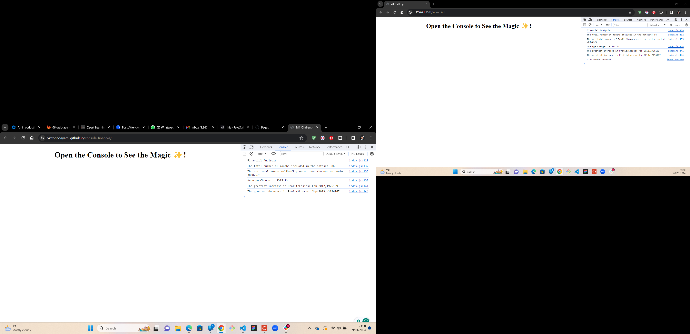

# console-finances
Console finances Javascript

Declared variables to provide answers to the questions in the challenge.
--The total number of months included in the dataset.
--The net total amount of Profit/Losses over the entire period.
--The average of the changes in Profit/Losses over the entire period.
--The greatest increase in Profit/Losses (date and difference in the amounts) over the entire period.
--The greatest decrease in Profit/Losses (date and difference in the amounts) over the entire period.

Created a loop for the variable interactions.
Created a const for averageChange.
Console logged the calcualted answers.

Deployed link: https://victoriadeyemi.github.io/console-finances/
